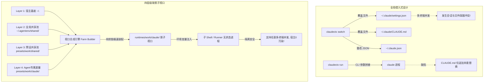

# 对标项目源码级深度剖析：claudectx vs AgentEnv (aenv)
# 架构范式、实现细节与技术选型对比分析报告

> **分析对象**: `claudectx` (GitHub: `foxj77/claudectx`, v1.3.0, Go 语言实现)  
> **对比项目**: `AgentEnv (aenv)` (基于 [intend.md](file:///D:/Projects/Go/AgentEnv/intend.md) 与 [spec.md](file:///D:/Projects/Go/AgentEnv/spec.md))  
> **分析维度**: 源码实现、存储拓扑、隔离机制、并发安全、跨平台能力与工程权衡

---

## 1. 项目概况与宏观定位对比

| 维度 | claudectx (v1.3.0) | AgentEnv (aenv) |
| :--- | :--- | :--- |
| **项目定位** | 针对 **Claude Code 单一工具** 的配置切换器 (Profile Switcher) | **通用、可扩展的 AI Coding Agent 基础设施运行时** (Infra Manager) |
| **支持工具** | 强绑定 `claude` (硬编码支持 Claude 的参数与配置格式) | 支持**任意 Agent** (Claude, Codex, Gemini, OpenCode, Pi 等)，解耦注册 |
| **隔离核心机制** | **全局文件硬覆写 (Switch) + 临时 CLI 参数拼装 (Run)** | **四层级联影子视口 (Shadow Viewport / Symlink Farm)** |
| **内容解析策略** | **深入解析** JSON 结构并定制重写 (Settings, MCP, Extras) | **文件系统即真理，零内容解析 (Content Agnostic)** |
| **终端交互模型** | 依赖全局状态文件与 Shell Completion 补全 | **零钩子子 Shell (Subshell) + 瞬时执行器 (Runner)** |

---

## 2. 源码级核心实现深入剖析 (Code Deep-Dive)

### 2.1 目录组织与存储拓扑 (Storage Architecture)

#### `claudectx` 源码实现 (`internal/paths/paths.go`, `internal/store/store.go`)
`claudectx` 将自身完全寄生在 Claude 的原生目录 `~/.claude/` 内部：
```text
~/.claude/
├── .claudectx-current          # 当前激活 Profile 名称 (文本记录)
├── .claudectx-previous         # 上一个 Profile 名称 (用于快速切换 `claudectx -`)
├── .claudectx-run/             # `run` 命令生成的临时目录
│   └── run-<nano>-<pid>/mcp.json
├── profiles/                   # 存放各 Profile 的实体文件
│   └── <name>/
│       ├── settings.json
│       ├── CLAUDE.md
│       └── mcp.json
├── backups/                    # 每次 Switch 生成的全量快照
│   └── backup-<nano>/
└── settings.json               # 宿主正在生效的全局配置
~/.claude.json                  # 全局 MCP 配置
```

#### 源码逻辑点评：
- **优点**：结构简单直观，用户容易理解。
- **致命缺陷**：
  1. **寄生宿主目录**：直接在 `~/.claude/` 下拉出一堆 `.claudectx-*` 点文件和 `profiles/` 目录，一旦 Claude Code 自身版本升级重构目录，容易发生命名冲突；
  2. **单 Agent 固化**：路径写死在 `paths.ClaudeDir()` (`~/.claude`)，完全无法迁移到 Codex (`~/.codex`) 或其他 Agent。

---

### 2.2 核心切换逻辑：全局硬写 vs 影子视口 (Switching Mechanism)

#### `claudectx Switch` 源码分析 (`cmd/switch.go`)
```go
// cmd/switch.go:88-133 截取
// 1. 保存设置到全局生效路径
settingsPath, _ := paths.SettingsFile() // ~/.claude/settings.json
config.SaveSettings(settingsPath, prof.Settings)

// 2. 直接覆写全局 CLAUDE.md
claudeMDPath, _ := paths.ClaudeMDFile() // ~/.claude/CLAUDE.md
if prof.ClaudeMD != "" {
    os.WriteFile(claudeMDPath, []byte(prof.ClaudeMD), 0644)
} else {
    os.Remove(claudeMDPath)
}

// 3. 动态修改全局 ~/.claude.json 中的 mcpServers 字段！
claudeJSONPath, _ := paths.ClaudeJSONFile()
mcpconfig.SaveMCPServers(claudeJSONPath, prof.MCPServers)
```

#### 源码逻辑点评与痛点：
1. **多终端并发灾难 (Race Condition)**：
   - 如果开发人员在终端 A 打开项目 A（需要 Work 预设），在终端 B 打开项目 B（需要 Personal 预设），`claudectx work` 会直接修改全局的 `~/.claude/settings.json` 和 `~/.claude.json`。
   - 终端 B 随后执行 Claude 时，将直接受到终端 A 的配置污染！**全局单态切换天然无法支持并发！**
2. **全局 `.claude.json` 破坏风险**：
   - `claudectx` 为了管理 MCP，直接读取并重新写入 `~/.claude.json`（见 `internal/mcpconfig/mcpconfig.go`）。如果 Claude 正在写入该文件，极易发生写写冲突导致 JSON 损坏。
3. **回滚机制 (`rollback`) 的脆弱性**：
   - 虽然有 `backupMgr.Create()` 与 `rollback()`，但若发生 `kill -9` 或断电，全局配置将处于残缺中间态。

#### `AgentEnv` 的破局方案：
- `AgentEnv` 坚决不做全局目录覆写，而是采用 **Shadow Viewport (软链农场)**。
- 视口目录位于独立隔离区 `~/.agentenv/runtimes/<preset>/<agent>/`，基底通过软链穿透，Preset 文件压制覆盖。**原生宿主 `~/.claude/` 始终保持纯净，多终端多项目并发零干扰！**

---

### 2.3 单次运行模式：CLI 参数拼装 vs 环境变量注入 (Run Mechanism)

#### `claudectx Run` 源码分析 (`cmd/run.go:118-164`)
`claudectx` 意识到 `switch` 无法解决多终端并发问题，因此在 v1.3.0 增加了 `claudectx run` 命令。其底层实现是通过构造参数传递给 `claude`：

```go
// cmd/run.go:118-164 核心参数装配代码
var claudeArgs []string

// 1. 通过 --settings 指向 Profile 的 settings.json
settingsPath, _ := paths.ProfileFile(opts.ProfileName, "settings.json")
claudeArgs = append(claudeArgs, "--settings", settingsPath)

// 2. 通过 --append-system-prompt-file 传递 CLAUDE.md
if strings.TrimSpace(prof.ClaudeMD) != "" {
    claudeMDPath, _ := paths.ProfileFile(opts.ProfileName, "CLAUDE.md")
    claudeArgs = append(claudeArgs, "--append-system-prompt-file", claudeMDPath)
}

// 3. 生成临时 mcp.json 并通过 --mcp-config 传递
if len(prof.MCPServers) > 0 {
    runName := fmt.Sprintf("run-%d-%d", time.Now().UnixNano(), os.Getpid())
    mcpPath := filepath.Join(base, runName, "mcp.json")
    mcpconfig.SaveClaudeMCPConfig(mcpPath, prof.MCPServers)
    claudeArgs = append(claudeArgs, "--mcp-config", mcpPath, "--strict-mcp-config")
}
```

#### 源码级致命妥协与缺陷分析 (来自官方 README 及代码注释)：
1. **CLAUDE.md 无法完全隔离 (关键妥协)**：
   - 因为使用的是 `--append-system-prompt-file`，**它是追加而非替换**！宿主原有的全局 `~/.claude/CLAUDE.md` **依然生效**！个人项目规则与公司规范会发生严重语义冲突。
2. **权限配置 (Permissions) 无法缩小**：
   - 官方文档明文提示：“Permission arrays (`allow`/`deny`) are merged — a profile cannot narrow permissions already granted globally.”
3. **运行时交互修改丢失**：
   - 用户在会话中敲 `/config` 产生的改动，依然写回全局 `~/.claude/settings.json`，不会沉淀到 Profile。
4. **为何 claudectx 不用 `CLAUDE_CONFIG_DIR`？**：
   - 查阅 `analyse/claudectx/docs/issue21.md:506` 发现：作者在技术调研时认为 `CLAUDE_CONFIG_DIR` 是“未文档化且有 Bug 的特性”，且直接重定向会导致登录 Token 丢失（需要重新 auth），因此放弃了该方案，退而求其次选择拼接参数。

#### `AgentEnv` 的优雅解法：
- `claudectx` 无法使用 `CLAUDE_CONFIG_DIR` 的根本原因在于它只懂“目录全量重定向”，导致 Token 和会话丢失。
- 而 `AgentEnv` 采用 **四层软链农场**：在影子视口内，把宿主的 `.credentials.json`、`history.jsonl`、`sessions/` 物理软链穿透过去，只有 `CLAUDE.md` 和 `settings.json` 是被覆写的。
- 这使得 `CLAUDE_CONFIG_DIR=~/.agentenv/runtimes/...` 既能**真正 100% 替换 `CLAUDE.md`**（而非追加），又能**无缝继承登录凭据与会话历史**！

---

### 2.4 配置解析策略：结构体解析 vs 内容无关 (Config Parsing Policy)

#### `claudectx` 的复杂 Unmarshaler 实现 (`internal/config/config.go:10-94`)
为了支持 `settings.json`，`claudectx` 编写了近 200 行高度复杂的自定义序列化逻辑：

```go
type Settings struct {
    Env         map[string]string `json:"env,omitempty"`
    Model       string            `json:"model,omitempty"`
    Permissions *Permissions      `json:"permissions,omitempty"`
    extras      map[string]json.RawMessage // 必须手工暂存未知字段！
}

func (s *Settings) UnmarshalJSON(data []byte) error {
    // 必须手工识别 known keys，把未知 key 放入 extras
    // 否则 Claude Code 新增的字段（如 effortLevel, autoDreamEnabled）会被静默吃掉！
}
```

#### 源码逻辑点评：
- **沉重的心智与维护包袱**：
  - 这种“二传手解析”导致每次 Claude Code 引入新格式，`claudectx` 都可能面临解析报错或格式序列化差异（如格式缩进变化、注释丢失）。
  - 对 MCP 的解析（`internal/mcpconfig/mcpconfig.go`）同理，必须维护 `MCPServer` 结构体。

#### `AgentEnv` 的降维打击：
- `AgentEnv` 确立了**“内容无关、文件系统为唯一真理”**的原则：
- 不做任何 JSON / TOML 解析，直接在文件系统层做软链映射。
- 无论 Agent 新增什么字段、采用什么格式（哪怕是 SQLite 或二进制），`AgentEnv` 均能 **0 代码修改、100% 原生兼容**。

---

### 2.5 自动同步设计：隐式 Magic 同步 vs 显式 Diff (Sync Mechanism)

#### `claudectx` 的 Auto-Sync 实现 (`cmd/sync.go`)
`claudectx` 在每次切换时，会通过 MD5 哈希比对当前全局配置与 Profile 配置是否发生变化：
```go
// cmd/sync.go:68-91
func profilesEqual(...) bool {
    hash1 := hashSettings(settings1)
    hash2 := hashSettings(settings2)
    // 比对 md5
}
```
若发生变动，它会在切换前**静默自动把全局文件写回 Profile**！

#### 潜在风险：
- 用户在全局测试修改了一个临时配置，切换时被自动写回了 Profile 仓库，导致 Profile 被“污染”。
- `AgentEnv` 拒绝这种隐式 Magic 行为，采用显式 `aenv preset diff` 提供统一 Diff 查看，坚持让文件系统保持可预测与确定性。

---

## 3. claudectx 源码给 AgentEnv 带来的宝贵启示与借鉴

在研读 `claudectx` 源码后，我们发现其具备数个极具价值的工程亮点，可直接吸收进 `AgentEnv`：

### 启示 1：`run` 模式的 `--dry-run` 预览支持
- **`claudectx` 做法** (`cmd/run.go:167-170`)：提供 `claudectx run <profile> --dry-run`，在真正拉起进程前，打印出完整的目标命令与装配参数。
- **AgentEnv 吸收建议**：在 `aenv run <preset> --dry-run` 中实现类似能力，打印将要注入的视口路径、环境变量以及拉起的目标命令，为开发者排错提供极大便利。

### 启示 2：统一前置验证拦截 (`internal/validator/validator.go`)
- `claudectx` 抽象了 `ValidateProfileName`（禁止 `/`, `\`, 空格, `.` 等），这与我们在 `spec.md` 中定义的正则 `^[a-zA-Z0-9_\-]+$` 完全契合。

### 启示 3：跨层级内容哈希缓存比对
- `claudectx` 在 `sync.go` 中实现的针对文件与结构的 MD5 哈希对比逻辑，可启发我们在 `spec.md` 的 `.synthesis_meta.json` 中，除了监控 `mtime` 之外，可对文件内容引入快速 Hash 校验，作为更底层的防冲突保障。

---

## 4. 架构全景对比总结矩阵



### 总结结论
`claudectx` 是一个在旧思维下针对 Claude Code 的单点实用工具，其 `switch` 的全局硬写方式在现代高频、多项目的多终端开发下存在严重的**并发冲突与配置污染风险**；其 `run` 模式受制于 CLI 参数拼接，无法彻底隔离指令与权限。

而 `AgentEnv` 的 **四层级联影子视口（Symlink Farm）+ 内容无关（Content-Agnostic）+ 无钩子子 Shell（Zero-Hook Subshell）** 架构，从根本底层上降维解决了这一难题：
1. **不局限于 Claude**，一套通用架构原生支持全网所有 AI Agent；
2. **彻底解决多终端并发隔离**，毫秒级合成且不改变宿主原生资产；
3. **凭据自然穿透，规则绝对覆盖**，无任何参数拼接带来的妥协与副作用。
