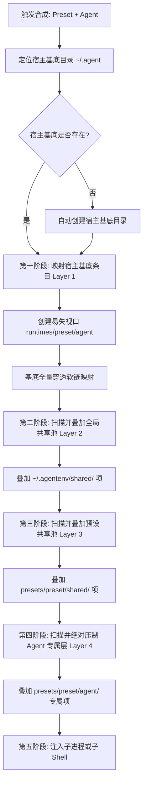
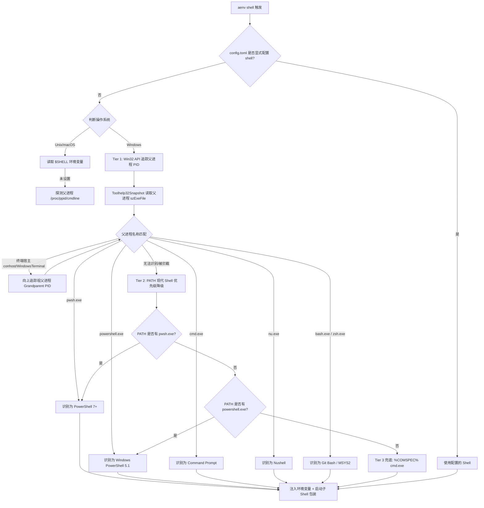

# AI Coding Agent 预设隔离运行时 (AgentEnv / aenv)
# 深度意图、架构演进与全技术分支决策规范 (intend.md)

---

## 1. 项目核心愿景、定位与架构哲学 (Vision & Philosophy)

### 1.1 项目定位：通用的 Agent 隔离基础设施管理器 (General Agent Infra Manager)
`agentenv`（简称 `aenv`）的定位是**轻量、极速、无侵入、零依赖的 AI Coding Agent 预设隔离与环境运行时管理器**。
它不是专门针对某一特定 Agent（如仅限 Claude 或仅限 Codex）的专属工具，而是一个**通用的基础设施级（Infra-level）管理层**。

**核心设计军规**：
1. **文件系统作为事实唯一来源 (Filesystem as the Single Source of Truth)**：
   - 坚决杜绝任何中间层 DSL、冗余 Manifest（如 `preset.toml`、`skills.yaml` 等）。
   - **“有即能用”原则**：Preset 目录下的文件拓扑结构与原生 Agent 主目录完全同构。Preset 里放了什么文件，视口中就覆盖什么文件；没放的文件，100% 穿透映射到宿主原生基底。
   - 共享池（`shared/`）同样遵循此道：需要复用时，在文件系统建立标准软链即可，系统绝不预设“这个文件夹应该有什么”、“这些文件是否该被 override”。
2. **通用可扩展，拒绝文件语义微管理 (Agnostic & Zero File Micromanagement)**：
   - 管理器不关心、不解析各 Agent 具体文件的内容语义（不关心某个文件是 JSON、TOML、YAML 还是 Markdown，也不硬编码哪个文件存了 Token、哪个文件存了 Model）。
   - 做到对**任意文件、任意格式、任意目录层级**的通用穿透与差量压制。
3. **原生无感与绝对隔离**：
   - 宿主全局的历史记录、数据库日志（SQLite/WAL）、大型缓存自然穿透与共享，杜绝数据割裂与磁盘膨胀。
   - 预设之间的规则、MCP 拓扑与配置物理隔离，杜绝全局脚本覆盖带来的并发竞态破坏（Race Condition）。
4. **零终端钩子侵入，开箱即用 (Zero-Hook, Zero-Config)**：
   - 坚决摒弃脆弱且高侵入性的终端钩子（无需 `eval "$(aenv init)"`），不修改用户的任何 Shell 配置文件（`.bashrc`, `.zshrc`, PowerShell `$PROFILE`）。
   - 纯 Go 语言自包含单二进制，下载即可在任意终端跑通，采用**子 Shell 派生 (Subshell)** 与 **瞬时执行器 (Runner)** 作为核心交互范式。

---

## 2. 存储拓扑与统一目录规约 (Storage & Directory Topology)

所有 AgentEnv 资产集中在宿主主目录下的 `~/.agentenv/`（Windows 下为 `%USERPROFILE%\.agentenv\`）：

```text
~/.agentenv/
├── config.toml                       # AgentEnv 全局配置（Agent 注册表、默认 Shell 偏好等）
│
├── shared/                           # [全局共享池] 跨预设通用的共享资产（第一级共享，自动穿透注入所有预设）
│   ├── skills/                       # 全局通用 Skill 脚本池
│   └── mcp/                          # 全局通用 MCP 配置片段
│
├── presets/                          # 用户真正维护的配置差量池（纯原生文件，完全受 Git 追踪）
│   ├── work-backend/                 # 预设命名空间 A
│   │   ├── shared/                   # [预设共享池] 预设内部跨 Agent 共享资产（第二级共享，自动分发给该预设下所有 Agent）
│   │   │   ├── .mcp.json             # 共享给该预设下所有 Agent 的 MCP 拓扑
│   │   │   ├── AGENTS.md             # 共享给该预设下所有 Agent 的指令规范
│   │   │   └── skills/               # 共享给该预设下所有 Agent 的技能
│   │   │       └── db-tools.sh
│   │   ├── claude/                   # [Agent 专属覆盖]
│   │   │   ├── CLAUDE.md             # [覆盖] 原生规范文件
│   │   │   └── settings.json         # [覆盖] 任意原生配置文件
│   │   └── codex/                    # [Agent 专属覆盖]
│   │       └── config.toml           # [覆盖] Codex 原生配置
│   │
│   └── personal-frontend/            # 预设命名空间 B
│       ├── shared/                   # 预设内部共享
│       └── claude/
│           └── CLAUDE.md             # [覆盖]
│
└── runtimes/                         # 易失影子视口运行区 (Shadow Viewports，支持一键清空)
    └── work-backend/
        ├── claude/                   # 目标 Agent 环境变量直接指向该目录
        │   ├── history.jsonl  ─────────► 穿透指向宿主真实的 ~/.claude/history.jsonl (Layer 1)
        │   ├── sessions/      ─────────► 穿透指向宿主真实的 ~/.claude/sessions/     (Layer 1)
        │   ├── .credentials.json ──────► 穿透指向宿主真实的 ~/.claude/.credentials.json (Layer 1)
        │   ├── shared-skill/  ─────────► 继承自全局 shared/skills/                 (Layer 2)
        │   ├── .mcp.json      ─────────► 压制自 presets/work-backend/shared/.mcp.json (Layer 3)
        │   ├── settings.json  ─────────► 压制自 presets/work-backend/claude/settings.json (Layer 4)
        │   └── CLAUDE.md      ─────────► 压制自 presets/work-backend/claude/CLAUDE.md   (Layer 4)
        └── codex/
            └── ...
```

---

## 3. 视口合成引擎核心算法与规约 (Synthesis Engine: The Symlink Farm)

### 3.1 四层自动级联继承模型 (Four-Tier Cascading Inheritance Pipeline)

视口合成引擎以极高的毫秒级速度运行，无论 Agent 拥有多少文件或多深目录，算法统一抽象为 **四层自动级联继承流水线**：

```text
[Layer 1] 宿主原生基底 (Host Base: ~/.<agent>/)
      ▲
      │ 穿透 / 被压制覆盖
[Layer 2] 全局共享池 (Global Shared: ~/.agentenv/shared/)
      ▲
      │ 穿透 / 被压制覆盖
[Layer 3] 预设共享池 (Preset Shared: ~/.agentenv/presets/<preset>/shared/)
      ▲
      │ 最终覆盖
[Layer 4] Agent 专属覆写 (Agent Specific: ~/.agentenv/presets/<preset>/<agent>/)
```



### 3.2 深度递归合并规则 (Directory-Merge Invariants)
- **单项文件冲突**：后一层级（Layer N+1）的文件无条件覆盖前一层级（Layer N）的同名文件。
- **目录冲突（跨层级同名目录）**：
  - 例如 Layer 1 有 `skills/`，Layer 2 也有 `skills/`，Layer 3 也有 `skills/`。
  - 引擎在影子视口中创建真实的实体子目录 `runtimes/.../skills/`，递归深入合并每一层叶子节点。
  - 下层独有项持续穿透向上合并，同名项由上层直接替换软链指向，实现完美的“多层资产无缝融合与精确覆写”。
- **单方独有目录**：若某个目录仅在单一层级出现，直接做单点目录软链挂载，保持毫秒级性能。

---

## 4. 全技术分支裁决与工程决策 (All Technical Branches)

### 分支 1：跨平台文件系统链接原语 (Windows vs POSIX Linking)

#### 决策裁定：纯原生 Symlink + 强制 Developer Mode
- **核心逻辑**：
  - 在 Linux / macOS 下，采用 POSIX 原生 `os.Symlink`。
  - 在 **Windows** 下，坚决统一使用原生 `os.Symlink`，要求系统开启 **Developer Mode（开发者模式）**。
  - 坚决杜绝任何 Hardlink（避免跨卷失效与文件原子写断裂）和 Copy-on-Write 降级（避免数据同步丢状态破坏 Infra 确定性）。
- **Windows 防御与诊断设计**：
  - `aenv` 启动时进行 Windows Pre-flight 检查。若检测到 Windows 平台未开启开发者模式且非管理员，友好拦截。
  - 提供 `aenv doctor` 诊断指令，一键输出开启开发者模式的方法：
    ```powershell
    # 管理员 PowerShell 一键开启开发者模式：
    reg add "HKEY_LOCAL_MACHINE\SOFTWARE\Microsoft\Windows\CurrentVersion\AppModelUnlock" /t REG_DWORD /f /v "AllowDevelopmentWithoutDevLicense" /d "1"
    ```

---

### 分支 2：配置差量粒度与内容语义 (Content Agnostic Policy)

#### 决策裁定：纯文件系统差量覆盖，零内容语义解析
- **核心逻辑**：
  - `aenv` 是通用基础设施管理器，绝不尝试去解析各 Agent 配置文件的内部格式（不管它是 JSON, TOML, YAML 还是 SQLite）。
  - **任何文件在 Preset 存在即覆盖，不存在即穿透**。
  - 针对敏感 Token 凭据与行为配置混杂的情况：由 Agent 自身的解耦机制（例如环境变量 `ANTHROPIC_API_KEY`、独立凭据文件 `.credentials.json`）处理，或用户自行在 Preset 中按需编排。
  - 管理器保持纯粹与高度稳定，绝不引入易损的 JSON Deep Merge 或中间 DSL。

---

### 分支 3：环境激活范式与无钩子架构 (Hookless Architecture & Shell Engine)

#### 3.1 为什么坚决剔除终端钩子（Shell Hook）？
传统工具（如 Conda/NVM）强制依赖 `eval "$(aenv init)"` 修改当前终端环境，存在致命缺陷：
1. **安装门槛极高**：必须修改 `.bashrc`、PowerShell `$PROFILE`。在 Windows 下极易因 `ExecutionPolicy Restricted` 触发安全报错；
2. **多 Shell 维护地狱**：必须为 Bash, Zsh, Fish, PowerShell 5.1, PowerShell 7+, Cmd 分别编写转义脚本；
3. **环境隐式污染**：激活后无法清晰感知环境边界，退出时极易遗留脏环境变量。

#### 3.2 核心替代交互：子 Shell 派生模式 (Subshell) 与瞬时执行器 (Runner)
- **模式 A：子 Shell 派生 (`aenv shell <preset>[/<agent>]`)**（日常交互首选，别名 `aenv activate`）：
  - `aenv` 毫秒级合成影子视口；
  - 启动隔离的子 Shell 进程，将环境配置变量（如 `CLAUDE_CONFIG_DIR`）注入该子进程；
  - 终端提示符带上 `[aenv:<preset>]` 前缀，用户正常直接输入 `claude`、`codex`；
  - 结束工作时输入 `exit` 或按 `Ctrl+D`，子 Shell 销毁，瞬间干干净净回到宿主原始环境，**对宿主终端 0 污染、0 残留**！
- **模式 B：瞬时运行执行器 (`aenv run <preset>[/<agent>] -- <cmd>`)**（脚本与自动化首选）：
  - 合成视口 -> 直接启动命令子进程 -> 执行完毕退出，完全无状态。

#### 3.3 跨平台 Shell 探测引擎深度设计 (Cross-Platform Shell Detection Engine)

**Windows 核心痛点**：
Unix 默认在登录时设置 `$SHELL` 环境变量（如 `/bin/zsh`），但 **Windows 没有 `$SHELL`**！
并且 Windows 上的 `%COMSPEC%` 环境变量几乎永远写死指向 `C:\Windows\System32\cmd.exe`，即便用户当前在现代 PowerShell 7 (`pwsh`) 或 Windows Terminal 中运行，`%COMSPEC%` 依然是 `cmd.exe`。如果粗暴调用 `%COMSPEC%`，会导致 PowerShell 用户被直接打入 CMD 终端，丢弃所有别名与终端主题。

**解决方案：三级探测金字塔 (Three-Tier Detection Pyramid)**



**Windows Win32 父进程探测底层实现技术规约**：
1. Go 语言通过 `os.Getppid()` 获取父进程 PID；
2. 调用 Windows 系统底层 API `CreateToolhelp32Snapshot(TH32CS_SNAPPROCESS, 0)` 遍历系统进程快照；
3. 比对 `PROCESSENTRY32W.th32ProcessID == ppid`，提取可执行文件名称 `szExeFile`；
4. 若直接父进程是 `WindowsTerminal.exe`、`conhost.exe` 或 `code.exe`（IDE 终端），递归读取祖父进程（`th32ParentProcessID`），锁定真正与用户交互的 Shell。

**各 Shell 内存级 Prompt 装饰技术 (In-Memory Prompt Injection，绝不写盘)**：
为了在子 Shell 中清晰标识当前生效的预设（如显示 `[aenv:work-backend] >`），且**绝对不向用户的配置文件写入任何代码**，采用纯内存传参封装：

- **PowerShell 7 (`pwsh`) / PowerShell 5.1 (`powershell`)**：
  ```go
  // 构造内存级启动指令，-NoExit 保持运行，退出即丢弃
  promptCmd := fmt.Sprintf(`function prompt { "[(aenv:%s)] " + (Get-Location) + "> " }`, presetName)
  cmd := exec.Command(shellPath, "-NoLogo", "-NoExit", "-Command", promptCmd)
  ```
- **Command Prompt (`cmd.exe`)**：
  ```go
  promptStr := fmt.Sprintf("[aenv:%s] $P$G", presetName)
  cmd := exec.Command("cmd.exe", "/k", "prompt", promptStr)
  ```
- **Unix (Bash / Zsh / Fish)**：
  ```go
  // 将 PS1 注入进程环境，并以交互模式启动
  env = append(env, fmt.Sprintf("PS1=[aenv:%s] \\u@\\h:\\w\\$ ", presetName))
  cmd := exec.Command(shellPath, "-i")
  ```

#### 3.4 交互式多 Agent 选择器 (Interactive Selector)
- 当用户执行 `aenv shell work-backend`（未指定具体 Agent 后缀）时：
- 终端弹出**方向键交互式菜单**（基于 Bubbletea 驱动）；
- 列出该预设下检测到的所有 Agent（如 `[x] claude`, `[x] codex`），用户通过空格多选/单选；
- 确认后，一次性为所选的所有 Agent 合成视口并在子 Shell 中完成环境变量注入。

---

### 分支 4：共享资源（Skills / MCP）关联模式 (Shared Assets Strategy)

#### 决策裁定：纯文件系统软链引用，“有即能用”
- **核心逻辑**：
  - 彻底摒弃清单文件（No `preset.toml`）。
  - `shared/` 是全局可复用的资产池。
  - 用户需要将共享池中的某个 Skill 引入某个 Preset 时，直接在文件系统建立相对软链：
    ```bash
    # 例如：
    ln -s ../../../shared/skills/git-flow presets/work-backend/claude/skills/git-flow
    ```
  - `aenv` 视口合成引擎在遍历 `presets/` 时，自然地跟随软链将目标资产挂载进入影子视口。
  - **“有即能用”**：文件系统即是配置，所见即所得。

---

### 分支 5：视口生命周期与并发控制 (Viewport Concurrency & Cleanup)

#### 决策裁定：预设级可复用视口 + 原子交换 (Atomic Swap)
- **视口拓扑**：
  - 默认路径采用可预测的单例结构：`~/.agentenv/runtimes/<preset>/<agent>/`。
  - 无论同一终端打开多少个窗口，同名预设共享同一影子视口，完美贴合 Agent 底层的并发设计（如 SQLite WAL 读写分离机制）。
- **合成原子性 (Two-Phase Atomic Swap)**：
  - 视口合成时，先在 `runtimes/.staging-<uuid>` 中完成所有的软链映射与健全性校验。
  - 校验无误后，通过目录原子 Rename 操作替换线上视口，避免终端进程读到半合成状态。
- **清理维护**：
  - `aenv clean`：安全一键抹除整个 `runtimes/` 目录。由于 `runtimes/` 纯粹由软链构成，清理操作瞬间完成且绝不丢失任何用户真实数据。

---

### 分支 6：Agent 适配器注册架构 (Agent Metadata Registry)

#### 决策裁定：内置主流配置 + 外部通用 TOML 扩展

管理器本身对具体 Agent 是解耦的，通过极简的注册表抽象：

```toml
# ~/.agentenv/config.toml

[terminal]
# 可选：显式强制指定的默认 Shell（留空则自动走智能探测引擎）
# shell = "pwsh"

# 内置主流预设规则（默认自包含，开箱即用）
[agents.claude]
env_var = "CLAUDE_CONFIG_DIR"
host_dir = "~/.claude"

[agents.codex]
env_var = "CODEX_CONFIG_DIR"
host_dir = "~/.codex"

[agents.gemini]
env_var = "GEMINI_CONFIG_DIR"
host_dir = "~/.gemini"

# 用户自定义小众 Agent 扩展（无限拓展）
[agents.opencode]
env_var = "OPENCODE_HOME"
host_dir = "~/.opencode"
```

每个 Agent 的适配元数据仅需 2 项核心要素：
1. `env_var`：该 Agent 读取配置目录所使用的环境变量名；
2. `host_dir`：该 Agent 在宿主机器上的真实配置基底路径。

---

## 5. 极端边界场景与防御策略矩阵 (Edge Cases & Defensive Matrix)

| 场景 | 潜在故障 / 风险 | AgentEnv 防御体系与响应规约 |
| :--- | :--- | :--- |
| **1. 宿主基底目录为空** | 新机器未运行过该 Agent，`~/.claude` 不存在，构建报错。 | **自动筑基 (Lazy Bootstrap)**：合成前若检测到宿主目录不存在，自动创建空基底，保证软链目标合法。 |
| **2. 悬空软链与死链 (Dangling Symlinks)** | 宿主删除了某个旧文件，导致影子视口指向空目标。 | **构建前自愈 (Pre-flight Sanitization)**：扫描时自动探测目标可达性，跳过或清除死链。 |
| **3. Windows 开发者模式未开启** | 普通用户执行 `os.Symlink` 抛出 `ERROR_PRIVILEGE_NOT_HELD (0x522)`。 | **诊断拦截 (Friendly Doctor Alert)**：捕获该特定 Windows 错误，友好拦截并打印开启开发者模式的指引与命令。 |
| **4. Windows 无 $SHELL 探测失败** | 父进程被防病毒软件隐藏或探测受阻。 | **三级降级梯队 (Detection Fallback)**：依次回退至 PATH 中的 `pwsh` -> `powershell` -> `%COMSPEC%`，确保 100% 能够拉起子 Shell。 |
| **5. 并发合成写冲突** | 多个终端同时拉起同一预设触发重新合成。 | **轻量文件租约锁 (Staging Lock)**：在 `.staging/` 目录引入轻量文件锁，确保合成过程互斥且原子。 |
| **6. 目录嵌套深度递归** | 存在很深的递归子目录导致性能下降。 | **惰性单点挂载 (Lazy Subtree Link)**：仅当双方均存在同名子目录时才向下递归一层；单方存在时直接整树挂载。 |

---

## 6. 完整 CLI 指令集与交互规范 (CLI Specification)

```bash
# 1. 进入预设隔离子 Shell (无钩子，纯子进程，exit 即退出)
aenv shell work-backend             # 弹出方向键交互菜单，选择要激活的 Agent，并派生子 Shell
aenv shell work-backend/claude      # 直接定向派生带有 Claude 隔离环境的子 Shell
aenv activate work-backend          # [别名兼容] 语义同 aenv shell

# 2. 瞬时运行执行器 (无状态单次运行模式，无需进入子 Shell)
aenv run work-backend/claude -- claude
aenv run work-backend -- codex --sandbox=strict

# 3. 环境变量导出辅助 (仅供极客与外部脚本使用，非系统依赖)
aenv env work-backend/claude        # 打印当前视口环境变量导出语句

# 4. 预设资产管理 (纯文件操作快捷方式)
aenv preset list                    # 树形展示所有预设、包含的 Agent 与覆盖文件
aenv preset create <name>           # 创建新预设目录骨架
aenv preset add <preset> <agent> <path> # 从宿主拷贝正在使用的文件到预设作为起点
aenv preset diff <preset>           # 查看预设文件与宿主基底文件的差异 (diff)
aenv preset edit <preset> <agent> <file> # 快速用系统 $EDITOR 打开编辑预设文件

# 5. 系统状态与自检诊断
aenv status                         # 查看当前运行中的预设影子视口与进程状态
aenv clean                          # 一键清空 ~/.agentenv/runtimes/ 影子缓存
aenv doctor                         # 检查系统权限(Windows Developer Mode)、Shell 探测状态与 Agent 探针
```

---

## 7. Go 工程模块组织方案 (Go Implementation Blueprint)

```text
agentenv/
├── cmd/
│   └── aenv/
│       └── main.go                   # CLI 入口与子命令注册 (Cobra 驱动)
│
├── internal/
│   ├── config/                       # 配置规约与注册表
│   │   ├── config.go                 # ~/.agentenv/config.toml 解析
│   │   └── agent.go                  # Agent 元数据模型与内置列表
│   │
│   ├── engine/                       # 视口合成与合并核心
│   │   ├── synthesizer.go            # 两阶段原子合成算法 (Farm Builder)
│   │   ├── cleaner.go                # 视口清理与死链回收
│   │   └── inspector.go              # Preset 差量文件扫描与状态探针
│   │
│   ├── platform/                     # 跨平台链接抽象
│   │   ├── symlink_unix.go           # POSIX 平台软链驱动
│   │   ├── symlink_windows.go        # Windows 软链与 Developer Mode 状态探测
│   │   └── symlink.go                # 统一 Link 接口 (CreateSymlink, ValidateLink)
│   │
│   ├── shell/                        # 无钩子子 Shell 派生与探测引擎
│   │   ├── detect.go                 # 跨平台探测抽象接口
│   │   ├── detect_windows.go         # Windows Toolhelp32 父进程 PID 探测与降级
│   │   ├── detect_unix.go            # Unix $SHELL 与 /proc 探测
│   │   ├── subshell.go               # 子 Shell 拉起、环境注入与信号转发
│   │   ├── subshell_windows.go       # Windows 下 pwsh/powershell/cmd 内存级 prompt 包装
│   │   └── subshell_unix.go          # Unix 下 bash/zsh/fish 内存级 prompt 包装
│   │
│   └── ui/                           # 终端交互式 UI 组件
│       ├── menu.go                   # 方向键交互式选择菜单 (Bubbletea 驱动)
│       └── output.go                 # 格式化状态树与表格打印
│
├── go.mod
└── go.sum
```

---

## 8. 总结：核心理念再强调

> **“AgentEnv 是纯粹的基础设施管理者，不是配置内容的保姆，更不是侵入终端的黑客。”**  
> 1. **文件系统即真理**：有即能用，无即穿透；不造中间格式，不搞隐式魔术。  
> 2. **零安装负担**：坚决摒弃终端钩子，采用纯净 Subshell 与瞬时 Runner，开箱即用，退出即复原。  
> 3. **稳健跨平台**：内置专业的 Windows Win32 进程探针，精准识别父终端形态，完美支持 PowerShell 与 CMD。
