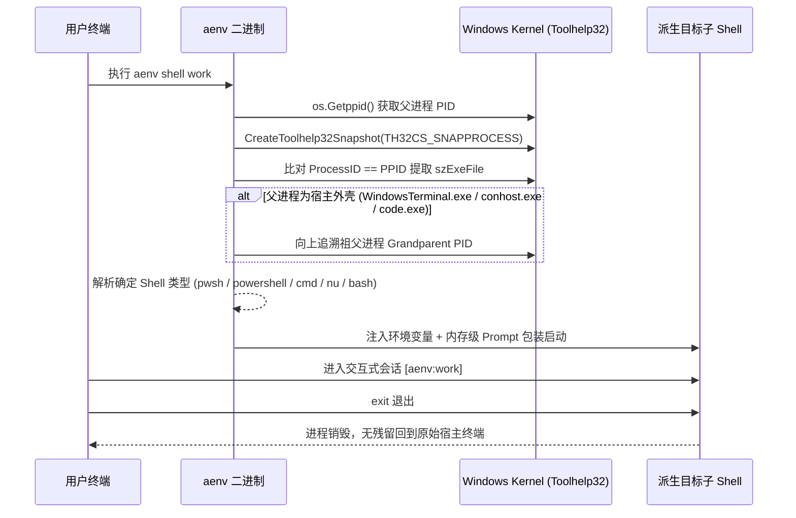

# AI Coding Agent 预设隔离运行时 (AgentEnv / aenv)
# 完整工程技术规范文档 (spec.md)

- **版本**: v1.0.0 (Official Release)
- **状态**: Approved (正式发行规约)
- **事实源**: [intend.md](file:///D:/Projects/Go/AgentEnv/intend.md)
- **语言实现**: Go 1.22+

---

## 1. 存储拓扑与文件系统物理规约 (Storage & Directory Specification)

### 1.1 根目录定位 (Root Path)
所有数据集中在用户主目录下：
- **Windows**: `%USERPROFILE%\.agentenv\`（如 `C:\Users\<username>\.agentenv\`）
- **Linux / macOS**: `~/.agentenv/`（如 `/home/<username>/.agentenv/` 或 `/Users/<username>/.agentenv/`）

### 1.2 物理目录树结构
```text
~/.agentenv/
├── config.toml                       # [File] 全局配置与 Agent 注册表
│
├── shared/                           # [Dir] 全局跨预设共享池 (Layer 2, 自动注入所有预设的全部 Agent 视口)
│   ├── skills/                       # [Dir] 全局通用技能集合
│   └── mcp/                          # [Dir] 全局通用 MCP 配置片段
│
├── presets/                          # [Dir] 用户维护的预设源码池（纯原生文件，完全受 Git 追踪）
│   └── <preset_name>/                # [Dir] 预设命名空间目录（单层标识符）
│       ├── shared/                   # [Dir] 预设内部跨 Agent 共享池 (Layer 3, 自动分发给该预设下所有 Agent)
│       │   ├── .mcp.json             # [File - Optional] 共享 MCP 拓扑
│       │   ├── AGENTS.md             # [File - Optional] 共享通用指令规范
│       │   └── skills/               # [Dir - Optional] 共享技能目录
│       │
│       ├── claude/                   # [Dir] Agent 专属差量目录 (Layer 4, 必须与注册表 agent 同名)
│       │   ├── CLAUDE.md             # [File] 专属规范覆盖
│       │   └── settings.json         # [File] 专属配置覆盖
│       └── codex/                    # [Dir] Codex 专属差量目录
│           └── config.toml           # [File] 专属配置覆盖
│
└── runtimes/                         # [Dir] 易失影子视口运行区（可安全一键清空）
    └── <preset_name>/
        ├── claude/                   # [Dir] 作为 CLAUDE_CONFIG_DIR 挂载点
        │   ├── .synthesis_meta.json  # [File - Internal] 增量比对与缓存校验元数据
        │   ├── history.jsonl  ───────► 宿主基底 ~/.claude/history.jsonl (Layer 1)
        │   ├── sessions/      ───────► 宿主基底 ~/.claude/sessions/     (Layer 1)
        │   ├── global-tool.sh ───────► 全局共享池 ~/.agentenv/shared/... (Layer 2)
        │   ├── .mcp.json      ───────► 预设共享池 presets/<preset>/shared/.mcp.json (Layer 3)
        │   ├── settings.json  ───────► Agent专属 presets/<preset>/claude/settings.json (Layer 4)
        │   └── CLAUDE.md      ───────► Agent专属 presets/<preset>/claude/CLAUDE.md   (Layer 4)
        └── codex/
            └── ...
```

### 1.3 命名与合法性校验 (Naming Invariants)
- `<preset_name>`：必须符合正则 `^[a-zA-Z0-9_\-]+$`（仅限字母、数字、下划线、中划线），禁止出现斜杠 `/` 或 `\`，避免命名空间产生歧义。
- 预设根目录下的子目录：每个合法预设内部仅包含两类子目录：
  1. `shared/`：专属于该预设内部的跨 Agent 共享资源目录；
  2. `<agent_name>/`：Agent 专属目录，目录名必须在 `config.toml` 的 `[agents.<agent_name>]` 注册表中存在定义。
  3. **禁止零散根级文件**：预设根目录下不再允许散落松散孤立文件，所有共享内容统一收敛在 `shared/` 目录下。

---

## 2. 全局配置文件规范 (`config.toml` Schema)

`~/.agentenv/config.toml` 是极简的基础设施注册表，**不干预任何 Agent 具体配置文件的内部语义，不绑定具体执行二进制**。

### 2.1 完整 TOML 规范示例
```toml
# ~/.agentenv/config.toml

[terminal]
# 可选：显式指定拉起子 Shell 使用的程序（"pwsh" | "powershell" | "cmd" | "bash" | "zsh" | "nu"）
# 若留空或不配置，默认自动走三级智能探测引擎
# shell = "pwsh"

# -------------------------------------------------------------
# Agent 注册表 (Agents Registry)
# 每个 Agent 仅需声明其专用的环境配置变量名与宿主真实存储路径
# -------------------------------------------------------------

[agents.claude]
env_var = "CLAUDE_CONFIG_DIR"
host_dir = "~/.claude"

[agents.codex]
env_var = "CODEX_CONFIG_DIR"
host_dir = "~/.codex"

[agents.gemini]
env_var = "GEMINI_CONFIG_DIR"
host_dir = "~/.gemini"

[agents.opencode]
env_var = "OPENCODE_HOME"
host_dir = "~/.opencode"
```

### 2.2 字段定义模型 (Go Struct Alignment)
```go
package config

type Config struct {
    Terminal TerminalConfig           `toml:"terminal"`
    Agents   map[string]AgentConfig   `toml:"agents"`
}

type TerminalConfig struct {
    Shell string `toml:"shell"` // 留空则走自动探测
}

type AgentConfig struct {
    EnvVar  string `toml:"env_var"`  // 读取配置目录的环境变量名（如 CLAUDE_CONFIG_DIR）
    HostDir string `toml:"host_dir"` // 宿主真实基底路径，支持 ~ 解析（如 ~/.claude）
}
```

### 2.3 内置默认注册表 (Builtin Fallback)
若用户初次运行且未创建 `config.toml`，程序将自动以只读方式加载内置的主流 Agent 列表（Claude, Codex, Gemini），并提示创建默认 `config.toml`。

---

## 3. 视口合成引擎规范 (Synthesis Engine Specification)

### 3.1 四层自动级联继承模型 (Four-Tier Cascading Inheritance Pipeline)
合成某个 Agent 的影子视口 `runtimes/<preset>/<agent>/` 时，遵循严格的四层覆盖流水线：

```text
[Layer 1 (底层基底)] 宿主原生基底 (Host Base: ~/.<agent>/)
        ▲
        │ 穿透 / 被覆盖
[Layer 2 (全局共享)] 全局共享池 (Global Shared: ~/.agentenv/shared/)
        ▲
        │ 穿透 / 被覆盖
[Layer 3 (预设共享)] 预设共享池 (Preset Shared: ~/.agentenv/presets/<preset>/shared/)
        ▲
        │ 最终覆盖
[Layer 4 (Agent专属)] Agent专属差量 (Agent Specific: ~/.agentenv/presets/<preset>/<agent>/)
```

1. **第一阶段：基底投影 (Host Base - Layer 1)**
   - 检查 `host_dir`（如 `~/.claude`），若不存在则自动 `os.MkdirAll` 筑基。
   - 扫描基底目录下所有一级文件和子目录，在视口中批量创建原生软链接（Symlink）。
2. **第二阶段：全局共享叠加 (Global Shared - Layer 2)**
   - 检查 `~/.agentenv/shared/`，若存在，扫描其一级文件与目录。
   - 单文件覆盖底层软链，跨层级同名目录（如 `skills/`）实体化子目录并递归深入合并。
3. **第三阶段：预设共享分发 (Preset Shared - Layer 3)**
   - 扫描 `presets/<preset>/shared/` 目录。
   - 将预设级通用配置（如 `.mcp.json`, `AGENTS.md`）压制注入视口，覆盖 Layer 1 和 Layer 2 的同名条目。
4. **第四阶段：Agent 专属终极覆写 (Agent Specific - Layer 4)**
   - 扫描 `presets/<preset>/<agent>/`。
   - **单文件覆盖**：无条件解除下层软链，直接链接到该专属文件（终极覆写）。
   - **同名目录合并 (Smart Directory Merge)**：若存在同名目录，深入合并叶子节点，保持下层穿透能力。

### 3.2 增量比对与 mtime 缓存机制 (`.synthesis_meta.json`)
为避免在多终端并发以及 Windows 文件被占用时频繁重建软链引发 `ERROR_ACCESS_DENIED`，视口引入毫秒级增量校验：

#### 元数据结构 (`.synthesis_meta.json`)
```json
{
  "version": 1,
  "preset": "work-backend",
  "agent": "claude",
  "synthesized_at": "2026-10-03T00:00:00Z",
  "host_dir_mtime": 1775140200,
  "global_shared_mtime": 1775140100,
  "preset_shared_mtime": 1775140150,
  "preset_agent_mtime": 1775140180
}
```

#### 校验逻辑
每次调用合成时：
1. 读取视口中现存的 `.synthesis_meta.json`；
2. 获取 `host_dir`、`~/.agentenv/shared/`、`presets/<preset>/shared/`、`presets/<preset>/<agent>/` 的最新修改时间（mtime）；
3. **若四者 mtime 均未发生变化**：直接复用当前视口，耗时 `< 1ms`，零磁盘写操作；
4. **若发生变化**：执行增量更新，仅替换增减的 Symlink 节点，并刷新 `.synthesis_meta.json`。

---

## 4. 跨平台 Shell 探测与子 Shell 引擎规范 (Shell Engine)

### 4.1 Windows Win32 Toolhelp32 探测流水线
在 Windows 上，程序不依赖 `$SHELL`（不存在）和 `%COMSPEC%`（固定为 cmd），而是通过系统 API 追溯父进程：



### 4.2 各 Shell 内存级启动参数矩阵 (Zero Disk Write)

| Shell 类型 | 探测标识 (`szExeFile`) | 启动命令与参数构造 (Go 代码实现) | Prompt 装饰技术 |
| :--- | :--- | :--- | :--- |
| **PowerShell 7+** | `pwsh.exe` | `exec.Command("pwsh.exe", "-NoLogo", "-NoExit", "-Command", promptCmd)` | `function prompt { "[(aenv:" + $env:AENV_PRESET + ")] " + (Get-Location) + "> " }` |
| **Windows PS 5.1** | `powershell.exe` | `exec.Command("powershell.exe", "-NoLogo", "-NoExit", "-Command", promptCmd)` | 同上 |
| **Command Prompt** | `cmd.exe` | `exec.Command("cmd.exe", "/k", "prompt", "[(aenv:" + preset + ")] $P$G")` | 原生 `prompt` 指令 |
| **Nushell** | `nu.exe` | `exec.Command("nu.exe", "-e", "...")` | 内存更新 `$env.PROMPT_COMMAND` |
| **Git Bash** | `bash.exe` | `exec.Command("bash.exe", "--norc", "-i")` | 环境变量注入 `PS1="[(aenv:work)] \w\$ "` |
| **Unix POSIX** | `bash`, `zsh` | `exec.Command(os.Getenv("SHELL"), "-i")` | 环境变量注入 `PS1="[(aenv:work)] %~ %# "` |

### 4.3 环境变量注入清单 (Injected Env Vars)
派生子 Shell 或拉起子进程时，标准注入以下环境变量：
1. **Agent 专属变量**：根据所选 Agent，注入 `config.toml` 中定义的变量（如 `CLAUDE_CONFIG_DIR=C:\Users\mrx\.agentenv\runtimes\work\claude`）。
2. **系统元数据变量**：
   - `AENV_ACTIVE=1`
   - `AENV_PRESET=<preset_name>`
   - `AENV_AGENTS=<comma_separated_agents>`（如 `claude,codex`）
3. **自然嵌套规约 (Nesting Semantics)**：
   - 若在已有子 Shell 中再次执行 `aenv shell other-preset`，系统不拦截报错，而是直接拉起新子 Shell 覆盖环境变量；用户执行 `exit` 时自然逐层回退。

---

## 5. CLI 命令行接口规范 (Command-Line Interface)

### 5.1 命令树全景
```text
aenv
├── shell <preset>[/<agent>]          # 核心：派生预设隔离子 Shell (别名: activate)
├── run <preset>[/<agent>] -- <cmd>   # 核心：瞬时执行单次命令并退出
├── env <preset>[/<agent>]            # 辅助：仅输出环境变量语句 (只读)
│
├── preset                            # 预设维护子命令族
│   ├── list                          # 查看预设清单与差量状态
│   ├── create <name>                 # 初始化创建空预设脚手架目录
│   └── diff <preset>                 # 对比预设覆写文件与宿主基底文件的差异
│
├── doctor                            # 诊断系统权限、Windows 开发者模式及 Agent 状态
├── clean                             # 清空 runtimes/ 易失影子缓存
├── status                            # 显示当前运行中的视口及环境变量
└── version                           # 打印 aenv 版本信息
```

### 5.2 核心命令行为规范

#### 1. `aenv shell <preset>[/<agent>]`
- **输入**:
  - `aenv shell work-backend/claude`: 直接激活单一 Agent 并拉起子 Shell。
  - `aenv shell work-backend`: 若未指定 Agent 后缀，**自动触发终端交互式多选菜单**（Bubbletea），列出该预设下检测到的所有 Agent。空格选中，回车确认。
- **输出**: 终端原地切换至带有 `[aenv:<preset>]` 前缀的子 Shell。

#### 2. `aenv run <preset>[/<agent>] -- <command...> --<flags...>`
- **参数解构**: `--` 之前为 aenv 参数，`--` 之后完整透传给目标二进制。
- **退出码**: **100% 透明透传**。目标子进程退出码为 `N`，`aenv run` 的退出码即为 `N`。
- **标准流**: `Stdin`, `Stdout`, `Stderr` 直接与宿主终端挂载绑定，支持 PTY / 交互式输入。

#### 3. `aenv preset list`
- **输出格式**:
  ```text
  PRESETS                   TARGETS   ITEMS
  work-backend              shared    .mcp.json, AGENTS.md, skills/db-tools.sh
                            claude    settings.json, CLAUDE.md
                            codex     config.toml
  personal-frontend         claude    CLAUDE.md
  ```

#### 4. `aenv preset create <name>`
- 遵循“文件系统为唯一来源”哲学，不提供繁冗的细粒度添加命令，仅创建预设基础框架：
  - 自动创建 `~/.agentenv/presets/<name>/`；
  - 自动创建预设内部共享目录 `~/.agentenv/presets/<name>/shared/`；
  - 为已注册的 Agent 自动生成占位子目录（如 `claude/`, `codex/`）；
  - 用户可直接在 VSCode 或文件管理器中自由放置文件。

#### 5. `aenv preset diff <preset>`
- 遍历 `presets/<preset>/` 下的所有文件，调用内置的 Unified Diff 算法，对比其与宿主 `host_dir` 对应真实文件的差异并输出彩色高亮 Diff。

#### 6. `aenv doctor`
- **自检项目表**:
  1. **OS & Arch**: 操作系统与架构类型（如 `windows/amd64`）。
  2. **Symlink Capability**: 检测系统是否允许创建文件软链。若为 Windows 且未开启开发者模式，输出警告及一键开启 PowerShell 命令。
  3. **Shell Detection**: 探测当前父终端 Shell 进程及类型。
  4. **Agents Validation**: 遍历 `config.toml` 中注册的 Agent，检测对应 `host_dir` 是否存在。
  5. **Presets Storage**: 校验 `presets/` 下的各预设目录命名是否合法、软链是否健康。
  6. **Preset Framework Sync**: 自动扫描 `config.toml` 中新注册的 Agent；若发现已有预设中缺失对应目录，自动同步补齐预设框架目录（如 `presets/<preset>/<new_agent>/` 和 `shared/`）。
  7. **Runtimes Cache**: 校验运行时视口缓存状态及活跃视口数量。

---

## 6. 统一退出码与错误规范 (Exit Codes & Error Taxonomy)

### 6.1 退出码表 (Standard Exit Codes)

| 退出码 (Exit Code) | 语义类型 | 触发场景 | 典型错误提示 |
| :---: | :--- | :--- | :--- |
| **0** | `SUCCESS` | 正常执行完毕 | - |
| **1** | `ERR_BUSINESS` | 业务逻辑错误（预设或 Agent 不存在） | `Error: preset "foo" not found in presets/` |
| **2** | `ERR_USAGE` | 命令行参数或语法错误 | `Error: unknown flag: --invalid` |
| **3** | `ERR_SYSTEM` | 系统环境或权限错误（Windows 未开开发者模式） | `Error: symlink privilege not held. Please enable Developer Mode.` |
| **128+N** | `ERR_SIGNAL` | 进程接收到中断信号（SIGINT, SIGTERM） | 由目标子进程透传 |

### 6.2 Windows 开发者模式拦截处理规范
当在 Windows 下调用 `os.Symlink` 返回系统错误码 `0x522 (ERROR_PRIVILEGE_NOT_HELD)` 时：
1. 立即拦截底层 Panic；
2. 退出码设为 **3**；
3. 向 Stderr 友好输出：
   ```text
   [aenv] Windows 权限不足: 创建文件软链接需要开启开发者模式 (Developer Mode)。
   请以管理员身份打开 PowerShell 执行以下命令开启开发者模式，或前往系统设置手动开启：
   
   reg add "HKEY_LOCAL_MACHINE\SOFTWARE\Microsoft\Windows\CurrentVersion\AppModelUnlock" /t REG_DWORD /f /v "AllowDevelopmentWithoutDevLicense" /d "1"
   ```

---

## 7. Go 语言实现工程结构规范 (Go Project Structure)

```text
agentenv/
├── cmd/
│   └── aenv/
│       └── main.go                   # CLI 入口 (Cobra 子命令树装配)
│
├── internal/
│   ├── config/                       # 配置加载与注册表解析
│   │   ├── config.go                 # config.toml 读取与保存
│   │   ├── agent.go                  # Agent 注册表模型与内置列表
│   │   └── paths.go                  # ~/.agentenv 路径规约与解析
│   │
│   ├── engine/                       # 核心视口合成引擎
│   │   ├── synthesizer.go            # 三层分层合成流水线
│   │   ├── meta.go                   # .synthesis_meta.json 读写与 mtime 比对
│   │   ├── cleaner.go                # 易失视口清理与死链剔除
│   │   └── diff.go                   # 内置 Unified Diff 算法
│   │
│   ├── platform/                     # 跨平台链接操作抽象
│   │   ├── symlink.go                # 统一 Link 接口 (CreateSymlink, IsSymlink)
│   │   ├── symlink_unix.go           # POSIX 原生 os.Symlink 实现
│   │   └── symlink_windows.go        # Windows Developer Mode 检测与原生 Symlink
│   │
│   ├── shell/                        # 无钩子 Shell 探测与派生引擎
│   │   ├── detect.go                 # 统一探测接口
│   │   ├── detect_windows.go         # Win32 Toolhelp32 父进程追踪器
│   │   ├── detect_unix.go            # POSIX $SHELL 与 /proc 探测器
│   │   ├── subshell.go               # 子进程启动与标准流/信号桥接
│   │   ├── prompt_windows.go         # PowerShell / CMD 内存级 Prompt 生成
│   │   └── prompt_unix.go            # Bash / Zsh 内存级 Prompt 生成
│   │
│   └── ui/                           # 终端用户界面交互
│       ├── menu.go                   # Bubbletea 交互式多 Agent 选择器
│       ├── table.go                  # Doctor / Status 结构化表格打印
│       └── colors.go                 # 终端 ANSI 彩色高亮样式
│
├── go.mod
└── go.sum
```

---
*(本文档为 AgentEnv 唯一定量技术规范标准，所有代码实现、接口入参与单元测试均严格以此规范为准)*
